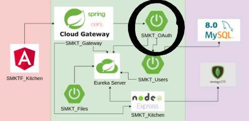

# SMKT_Oauth

Micro-service to manage tokens


[](https://sonarcloud.io/dashboard?id=AntonioAlejandro01_SMKT_Oauth)



## Use with Docker

Download docker image `docker pull antonioalejandro01/smkt-oauth:latest`

Run image

```bash
    docker run 
    -rm
    --name smkt-oauth
    -p 9100:9100 
    -e port=9100 
    -e eureka_url="http://localhost:8761/eureka"
    antonioalejandro01/smkt-oauth:latest
```

### Args

| Name | Description | Example |
| ---- | ----------- | ------- |
| port | Server Port | 9100 |
| eureka_url | Eureka Server Address | http ://localhost:8761/eureka |

## Others Micro-Service

- [SMKT_Eureka](https://github.com/AntonioAlejandro01/SMKT_Eureka)
- [SMKT_Gateway](https://github.com/AntonioAlejandro01/SMKT_Gateway)
- [SMKT_Files](https://github.com/AntonioAlejandro01/SMKT_Files)
- [SMKT_Kitchen](https://github.com/AntonioAlejandro01/SMKT_Kitchen)
- [SMKT_Users](https://github.com/AntonioAlejandro01/SMKT_Users)

## Frontend

- [SMKTF_Kitchen](https://github.com/AntonioAlejandro01/SMKTF_Kitchen)
